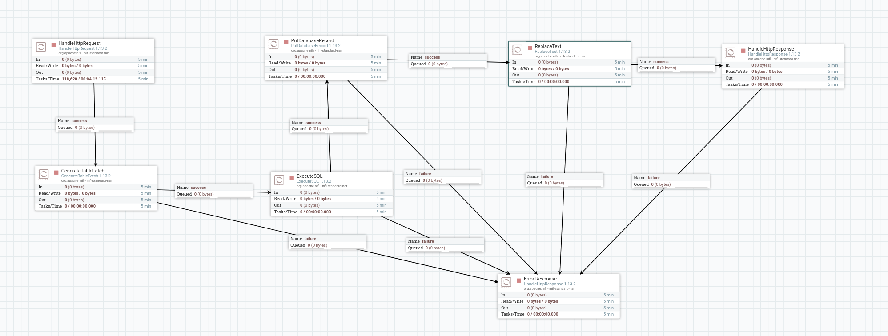
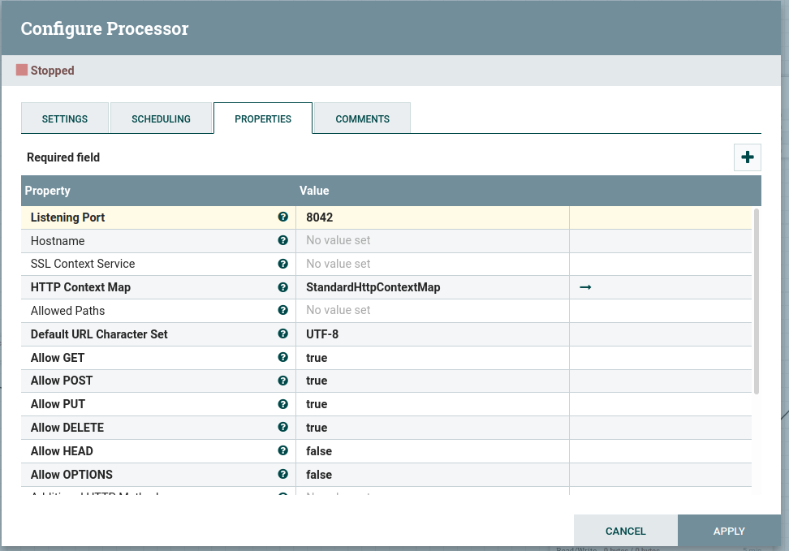
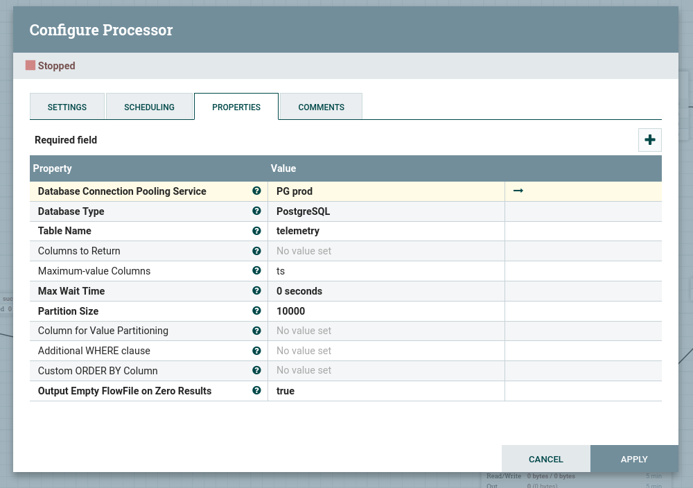
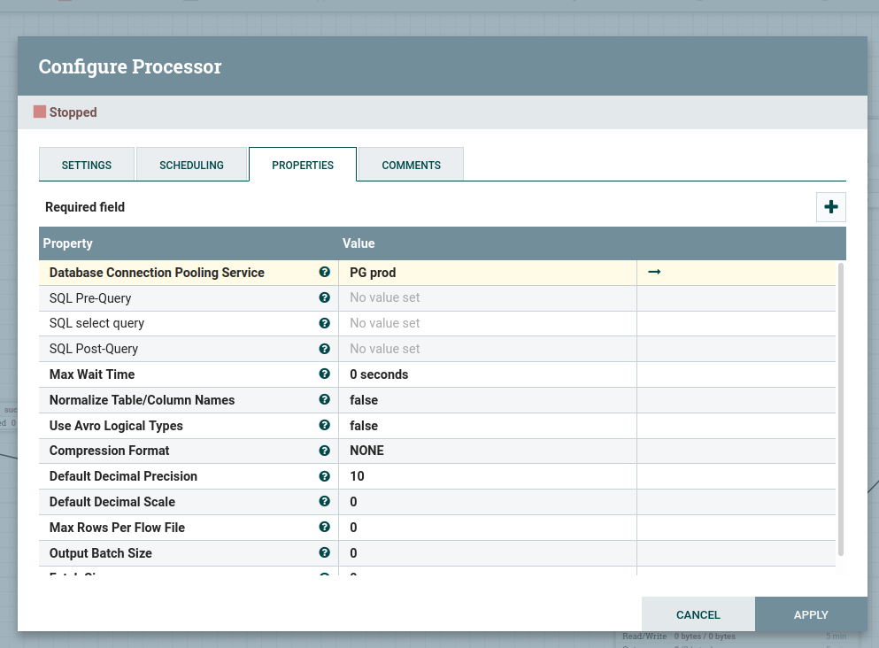
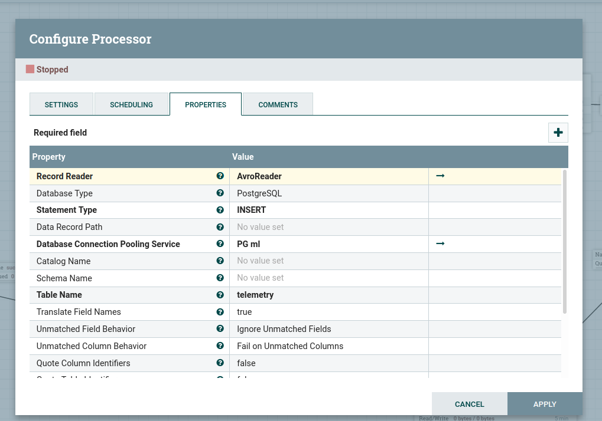
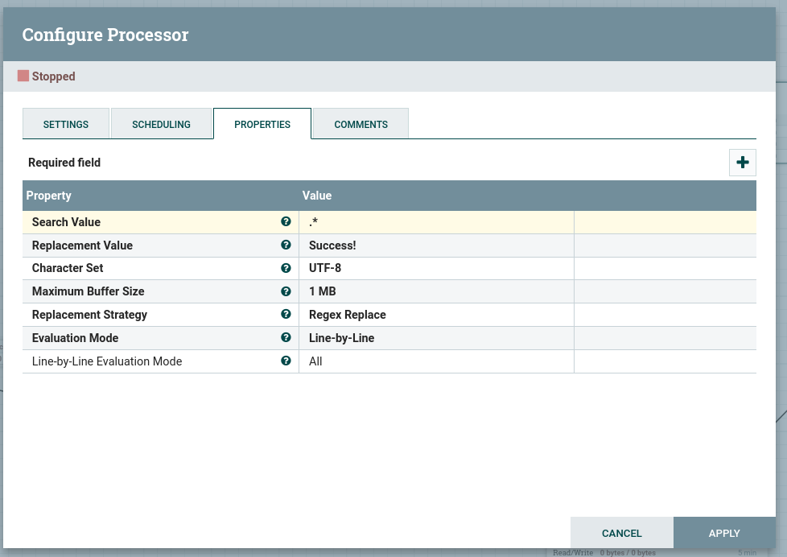
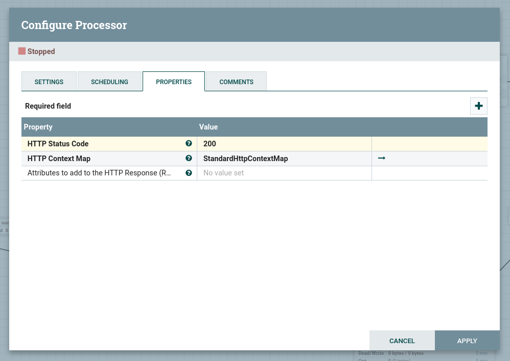
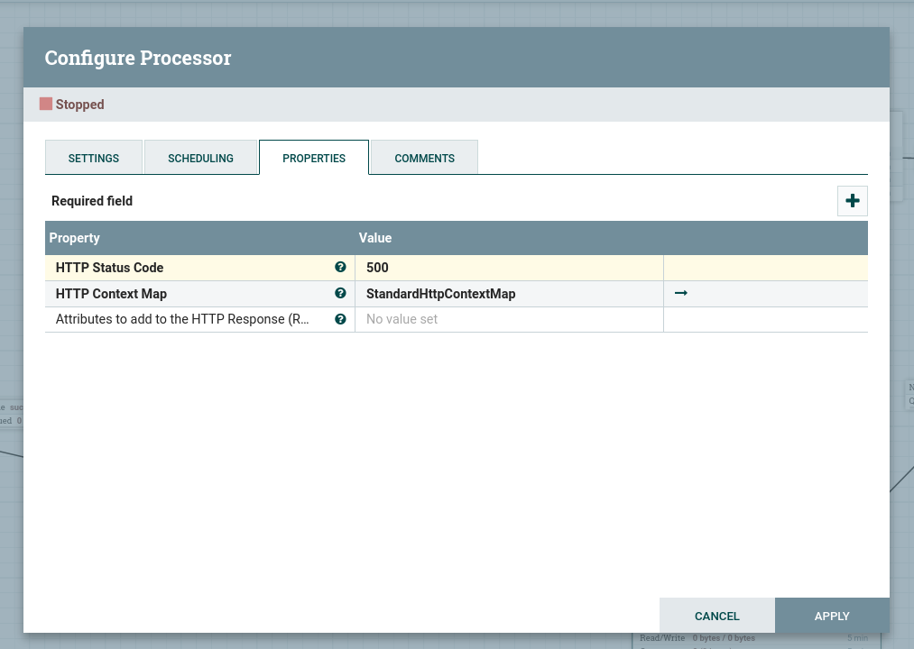
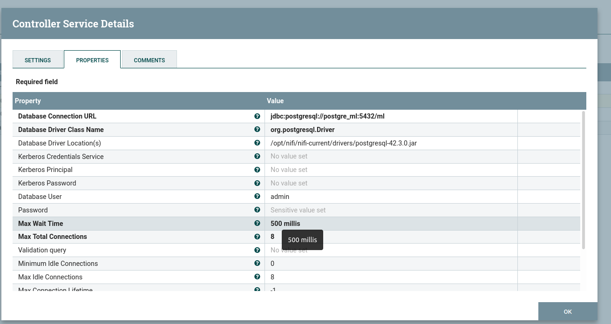
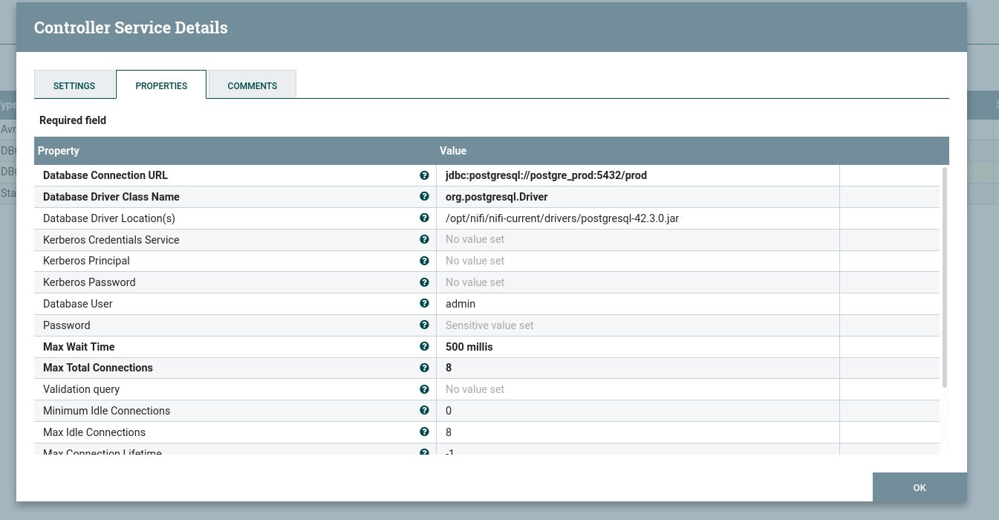

# nifi-postgresql-migration

[NiFi](https://nifi.apache.org/) flow to sync two SQL databases on request.

## Setup and run

Step 1: Start all the services: Nifi and our two database (postgre_prod/ml)

```bash
docker-compose up -d
```

Step 2: Install python dependencies to run python scripts

```bash
python3.7 -m pip install -r requirements.txt
```

Step 3: Create tables and populate the prod DB

```bash
python3.7 populate.py
```

Step 4: Got to the [nifi interface](http://localhost:8080/nifi) and start the flow (click on start button in the left box called `NiFi Flow`)

Step 5: Check that there is no data in the ml database

```bash
python3.7 check_data.py # output should be 1
```

Step 6: Create http request to migrate data from prod to dev

```bash
curl localhost:8042
```

Step 7: Check that data migrated and is present in the ml database

```bash
python3.7 check_data.py # output should be 1001
```

## Flow definition

Our flow consist of the following processors:

- [HandleHttpRequest](#HandleHttpRequest)
- [GenerateTableFetch](#GenerateTableFetch)
- [ExecuteSQL](#ExecuteSQL)
- [PutDatabaseRecord](#PutDatabaseRecord)
- [ReplaceText](#ReplaceText)
- [HandleHttpResponse](#HandleHttpResponse)



### HandleHttpRequest

Create a web service that listen on a port for incoming requests. When a request arrives, it will trigger the flow to be executed.

### GenerateTableFetch

Creates a SQL query to retrieve all the rows in table. For our use case, we specify the `Maximum-value columns`. See the description from the documentation:

```
A comma-separated list of column names. The processor will keep track of the maximum value for each column that has been returned since the processor started running. This processor can be used to retrieve only those rows that have been added/updated since the last retrieval.
```

### ExecuteSQL

This processor receives the constructed query from GenerateTableFetch and execute it on the DB.

### PutDatabaseRecord

Insert all the records returned by the ExecuteSQL processor into a specified DB.

### ReplaceText

Replace flow file content by success message to send back to the http request issuer

### HandleHttpResponse

Returns a response to the http request issuer.

## Flow configurations

Below are the configuration used for our local example.

### HandleHttpRequest



### GenerateTableFetch



### ExecuteSQL



### PutDatabaseRecord



### ReplaceText



### HandleHttpResponse




### Database connections

Step 1: Right-click in the browser and select `Configure`, than go to the `Controller services` tab.

Step 2: Create a new service. Select type: `DBCPConnectionPool`.

Step 3: Configure the service you just created by clicking on the small gear icon. In the settings tab, change the name to something more explicit (for example: `PG prod`). In the properties tab, you will need to fill the following properties (we take as example the postgre prod running in our docker compose):

- Database connection url: `jdbc:postgresql://postgre_prod:5432/prod`
- Database driver class name: `org.postgresql.Driver`
- Database driver location: `/opt/nifi/nifi-current/drivers/postgresql-42.3.0.jar`
- Database user: `admin`
- Password: `password`

When you are done configuring click on `Apply`.

Step 4: Enable your service by clicking on the small lightning icon.




## NIFI flow persistance

Nifi does'nt support well docker and volume persistance. So to be able to persist our flow when our container stops, we need to do some setup.

Step 1: create a directory named `nifi-data` and give all permissions on this dir.

```bash
mkdir nifi-data
sudo chmod 777 nifi-data
```

Step 2: Start nifi using the following compose configuration:

```yml
version: "3"
services:
  nifi:
    image: apache/nifi:1.13.2
    ports:
      - 8080:8080
    volumes:
      - ./nifi-drivers:/opt/nifi/nifi-current/drivers
      - ./nifi-conf:/home/nifi/conf
```

```bash
docker-compose up -d nifi
```

Step 3: Get the container id and enter it.

```bash
docker ps
docker exec -it <container_id> bash
```

Step 4: Copy nifi current dir into home:

```bash
cp -r /opt/nifi/nifi-current/conf /home/nifi/conf
```

Step 5: Remove deployed nifi

```bash
docker-compose down
```

Step 6: Change the compose configuration with the following.

```yml
version: "3"
services:
  nifi:
    image: apache/nifi:1.13.2
    ports:
      - 8080:8080
    volumes:
      - ./nifi-drivers:/opt/nifi/nifi-current/drivers
      - ./nifi-conf:/opt/nifi/nifi-current/conf
```

You are now good to go! Your flow will be persistent !
